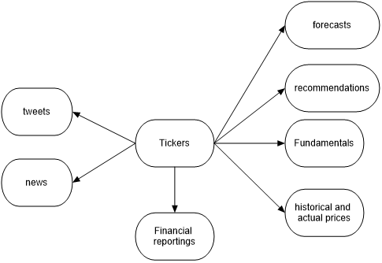
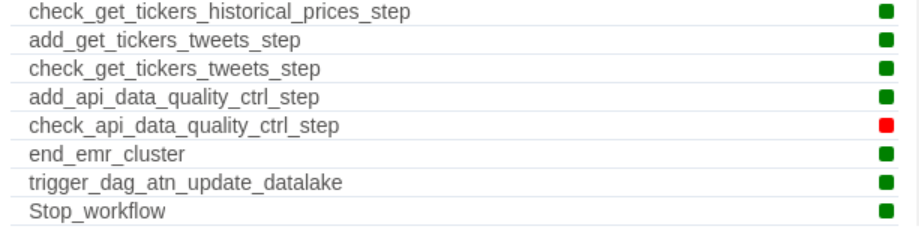
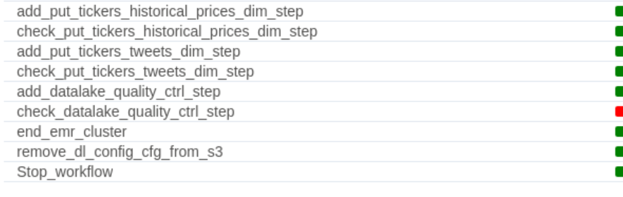
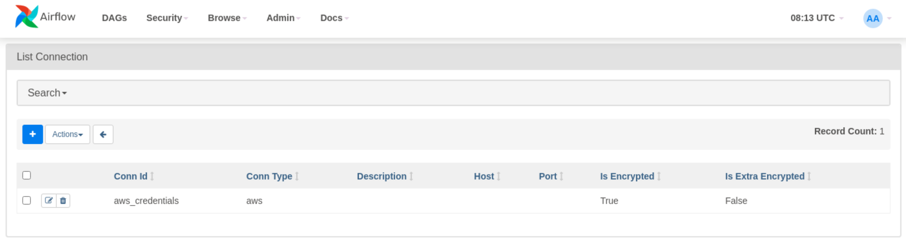
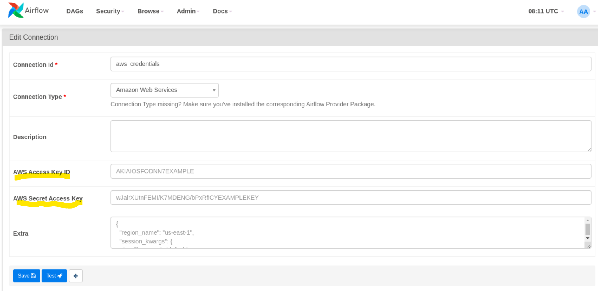
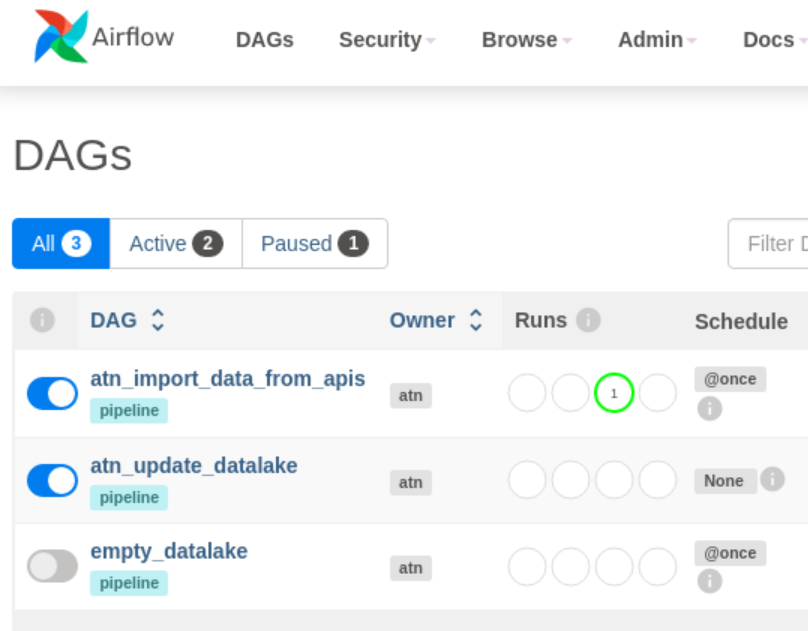
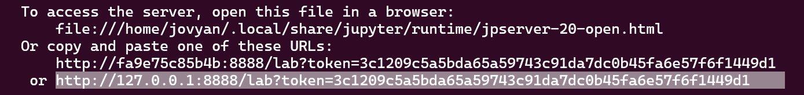
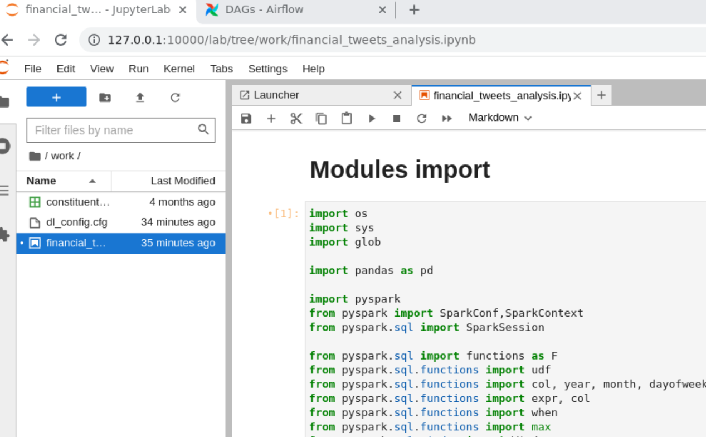

# Stock market and financial tweets data lake   
### (Udacity's Data Engineering Nanodegree Capstone project)
***

## Table of Contents
[1. Purpose and overview of the project](#purpose)  
[2. Udacity's requirements](#Udacity_requirements)  
[3. Data sources](#data_source)  
[4. Data processing](#data_processing)  
> [4.1 Data model](#data_model)  
> [4.2 Data dictionary](#data_dictionary)  
> [4.3 Dealing with duplicates in the data lake](#data_quality_issues)  
> [4.4 Data quality controls](#data_quality_control)  

[5. Airflow Pipeline](#pipeline)  
> [5.1 Pre-requisites to pipeline run](#pipeline_pre_requisites)   
> [5.2 Pipeline run commands ](#pipeline_run_commands)  
> [5.3 Using Airflow interface to monitor the pipeline](#airflow_interface)  

[6. Data exploration into the staging area and the data lake using Jupyter Lab](#data_exploration)  
> [6.1 Pre-requisites to Jupyter Lab run](#jupyter_pre_requisites)   
> [6.2 Jupyter Lab run commands ](#jupyter_run_commands)  
> [6.3 Data exploration with Jupyter Lab](#data_exploration)  

[7. Next steps](#next_steps)  

****

## 1. Purpose and overview of the project

This project constitutes the capstone project to __Udacity's data engineering Nanodegree programme__. As such, it complies with [Udacity's requirements](#Udacity_requirements). It is also an open-ended project as I wanted to use it for my own interests and I hope it could serve a large audience.

As I am from a finance background, I have always been interested in performing some sentiment analysis on  market data, by using sources such as tweets or financial news.

In this project, I'm building a pipeline that could fetch automatically stock markets' data from yahoo finance and financial tweets from Twitter via respective APIs on a scheduled basis, retreat them accordingly to fit in a [data model](#data_model) and dump the final data back into a data lake as parquet files. 

>To be noted that you can perfectly use the APIs directly without setting up a whole data lake pipeline. However, when it comes to historical prices per minute or hour, the timeframe to request them is limited. You cannot query beyond 10 days in the past. We have the same constrainst for tweets whereby the timeframe is 7 days in the past. The data lake comes handy as it allows to keep all the data accessible at any time and organised in a structured manner via a data model.

The pipeline is built with Apache Airflow and is run __locally from a docker container__, so you don't have to install Airflow on your computer. As a result, from you personal desk, you will be monitoring the status of running tasks.
All the tasks are eventually __run remotely by an AWS EMR instance using Spark and distributing task to workers__. So, you won't have to use the ressources of your own computer. It's all about __cloud computing and storage__ here. 

The pipeline fetches data from APIs and dumps the raw files (parquet and json files) in tothe __staging area__ and then processes them to produce the target files in the __data lake__. The staging area and the data lake are stored in an AWS S3 bucket. AWS log files and scripts log files are also produced all along and stored in the same bucket. 

I have also added some __docker commands__ to run a __Jupyter Notebook session__ so that I can query directly the data from the data lake.

This project combines the following tools:
1. `Docker engine` and `Docker compose`: These tools allow to run local containers where Apache Airflow and Jupyter Lab applications are installed for this project.
	> I use Docker version 20.10.17 and Docker Compose version v2.10.0.
2. `Apache Airflow` : The tool is used to schedule and monitor the workflows of the project's `ETL` (Extract, Transform, Load) pipeline.
	> I used Apache Airflow 2.3.4 in the Docker file.
3. `AWS EMR` (Amazon Web service `Elastic Map Reduce`) : It is a `cloud computing` service that allows to run big data on AWS cloud and is very cost effective. For this project, I have set up an EMR cluster with 2 workers to distribute the workload.
4. `Apache Spark` : It is a distributed computing system that can process big data quickly. I use it in conjunction with AWS EMR.
	> The Spark version installed in AWS EMR session is 2.4.8.  
	> The Spark version installed in the docker container running Jupyter Lab is 3.3.1.
5. `Python` : It is high-level programming language used for the project. With respect to Spark, I used `pyspark` API module.
	> The Python version installed in AWS EMR session is 3.7.15.  
	> The Python version installed in the docker container running Airflow is 3.7.13.  
	> The Python version installed in the docker container running Jupyter Lab is 3.10.8.

As you can imagine, the purpose of the project is way beyond implementing a pipeline pouring data into a data lake. I took the opportunity of the __Data Engineer's Nanodegree__ programme to implement it, but the next step is for me to implement a process that could perform some `sentiment analysis` on the financial tweets and news.
By requesting the data from the data lake, end users will be able to carry out some fundamental, technical and sentiment analysis. From a larger perspective , users can be extended to data scientists and data analysts.

> Note that the data lake is not suited for real-time decisions involving making money out of `minute` data as the pipeline is scheduled at specific time. That's why I recommended to use it only for __analysis/research purpose__.

## 2. Udacity's requirements

The capstone project comes with the following requirements:

1. Combine at least 2 sources of data (a main dataset and supplementary datasets).
> The project combines [3 sources of data](#data_source) :   
> - yahoo finance : via an API, it provides stock markets' data.
> - tweets from Twitter : via an API, it provides text messages related to financial tickers.
> - and [Stock symbols](#https://stock-symbol.herokuapp.com/) : via an API, it provides a referential of markets and indexes.  
> The `ticker` is the key component that allows to combine all the data from these different sources.

2. Process different file formats (at least 2).
> The data that are captured from APIs are stored as `parquet files` and `json files` in the staging area located in an AWS s3 bucket.  
> The files that constitute the data lake are stored as parquet files in the same s3 bucket. 

3. Overall, the dataset should have 1 million rows.
> The dataset from yahoo finance represents about 15K rows of historical prices per ticker and tweets from Twitter can be as much.    
> By default, the pipeline is set up to run on the first 2 tickers from the SP500 list in order to test the pipeline.  
	- the full list of tickers is in the [constituents.csv](airflow-docker/config/constituents.csv) file,  
	- and the number of tickers we want to work on is the parameter `emr_num_workers` in the [dl_config.cfg file](airflow-docker/config/dl_config.cfg).   
> If we were to run the pipeline on 1 million entries, we would have set up the number of tickers to the first 35 ones in the configuration file. 

4. Determine the end use-cases of the data (source-of-truth database, analytical database,...) and what queries could be answered.
> The data serves as a copy of a `source of truth` and it should answers questions pertaining to fundamental/technical analysis and sentiment analysis by comparing the market data against the tweets. It can also be used to carry out some strategies back-testing. 
> As such, the whole dataset needs to be __further cleaned__ by data scientists in order to get some analytical insights. Indeed, the __text data from tweets are to complex to clean within the scope of this pipeline__. 
> In the end, we could very well imagine some `datamarts` or `datawarehouses` being sourced from this datalake in order to answer specific needs.

5. Explore the data and identify data quality issues (missing values, duplicates,..) and define the steps taken to clean the data.:		

> When it comes to yahoo finance and tweets data quality, there are sometimes issues like __missing values__ and __consistency__ in the source data which lead to __duplicates__ in the data lake..  
> The missing values pertain to static data and also historical prices. Oftentimes, it's just a temporary state, so we can usually expect the correct value to be fed later on.
> __We will not imput a theoretical value to compensate for the missing value during this transitory period!__  
> There is also an issue with __consistency__, whereby past values can sometimes be updated multiple times afterwards.  
> We will aim to keep only the last value in both use cases and we will never question the __integrity and reliability of the data__, as the data sources (yahoo finance, Twitter) are responsible for it (they are called __golden sources__) and the project's data lake is meant to be solely a __copy or version of the sources of truth__ where the data is organised into a data model in order to support data analytics accross multiple data sources.  
> For example, let's consider a given ticker and datetime,  if a temporary price value is persisted into the data lake duting a run of the pipeline, the next run might get another value and we would find 2 values for the same ticker and period in the data lake.   
> See this [section](#data_quality_issues) to understand how the issue of duplicates in the datalake are dealt with.

6. Build a data model and explain the rationale behind it.
> The data model that relates to the parquet files stored in the data lake is a __relational data model__ and not a __dimensional data model__.  
> The purpose was to organise data from different sources into __granular entities__ having relationships via foreign keys. This would allow to make ad hoc queries to answer specific questions.  
> The relational data model ensures __there are no duplicates and only the latest value is considered for a given combinaison of values of primary keys__. As such, it supports __data consistency and integrity__.  
> A dimensional data model would have been limited as it requires a __central fact table__ and __multiple satellite dimension tables__ and allows to answer only a few questions by doing __slicing and dicing__ queries.  
> By convention, we will be talking about the __entities__ as __tables__. For example, the table `tickers_info_dim` represents all the instances of the class `ticker` and the columns represent its attributes and properties.  
> The data model is built on the `ticker` information which is very central across almost all entities.  
> The entities can be grouped in __functionnal blocs__ as shown in this [diagram](#functional_entities).
> The full-blown data model can be found [here](#data_model).

7. Build the data dictionary.
> The data dictionnary can be found [here](#data_dictionary).  
> It is a breakdown of all attributes per entity. Each entity is labelled as a fact table if it contains metrics and measurements. It is called a dimension table if it contains categorical columns that can add context to fact data. 

8. Define the steps to pipeline the data, build and run the pipeline.
> The pipeline diagram and details can be found [here](#pipeline).

9. Define how often the data should be updated.
> As the `minute` data from yahoo finance API and tweets from Twitter can only feched within a limited timeframe, I suggest to run the pipeline once a week.

10. Run at least 2 data quality checks.

> There are 2 data quality checks:
> - One at the end of the first pipeline that fetches data from APIs and dumps them into parquet files and json files in the staging area. The check consists of verifying if there are empty files that are written. 
> - Another one is found at the end of the second pipeline that transforms the files in the staging area into parquet files in the data lake. The checks consists of verifying whether there are empty files and duplicate entries for a given set of primary keys. 

> For both checks, in case of a fail (an empty file or duplicates are found), a notification is written into the log file in the EMR session and the status of the step in the DAG becomes red.

> __Note that a control fail is not preventing the next step to start__. Indeed, I have considered these data quality issues can be dealt with offline.

11. Define the approaches in the following scenarios:
    1. __The data is increased by 100 times__. 
    	> The data coming from APIs and processed by DAG1 :
    	- They could be increased 100 times by just increasing the number of tickers by 3500 (35 tickets equal to 1 million rows fetched). But this will translate into longer processing time.
    	- Currently, tests of the first pipeline (DAG1) have shown that it requires about 45 min to process just 2 tickers. This is mainly due to 2 root causes:
    		- the API response time which is dependant on the number of requests. The more tickers in a sigle API request, the longer it takes to respond. Twitter API, for one, has  a compulsory latence of 15 min for every 10 tickers. Moreover, if we make too many requests, we could get ourselves rate limited or even worse blacklisted by the API source system !
    		- The current pipeline is using a single EMR session running with 2 nodes. I opted for this solution because it is more cost effective than distributing API requests across multiple EMR sessions running in parallel; moreover, there is no time constraint to fetch the raw data within a fixed timeframe. 
    	- As a consequence, each step in the DAG1 is run one at a time in the EMR session. 
    	- In order to support a x100 increase and have reasonable processing time, we could set up parallel tasks for API requests within a single EMR session with the use of `EMR Step Functions`, instead of using local task scheduling with Airflow. `EMR Step Functions` are a way to pipeline multiple steps in the same way as Apache Airflow in AWS cloud. 
    		On top of this, we could have the new AWS pipeline run every day on a smaller and different scope of tickers in a round-robin way, so that every ticker is processed once a week.   
    		
		> The data coming from the staging area and processed by DAG2:
		- The number of parquet and json files written into the staging area will be increased by x100 as a consequence of the increasing number of tickers. DAG2 processing time will increase accordingly on account of 2 factors:  		
			* the volume of files in the staging area.
			* The reduction step that consists of concatening the files with the existing parquet files in the data lake and then reducing them according to the data model constraints before writing back the final files into the data lake. 
		- In order to support this volume increase, we could increase the number of nodes in the EMR cluster, on top of using Spark is used to distribute the work. `EMR Step Functions` could also be used witin the same EMR to organise tasks in a current way.
		
	2. __The pipeline runs everyday by 7am__.
    	> The current Apache Airflow pipeline can be scheduled to run on a daily basis, as long as the local docker container hosting the pipeline is running.
    	
	3. __The database is accessed concurrently by a hundred users__.
		> Let's assume that the data lake is accessed by the a hundred users.  
		How can they access it without any latency (waiting time)? By accessing  it using Spark to query the data, the latency could be reduced by a good deal.  
		However, this may not suffice. A better solution could be to build a __data warehouse__ as a front end to the data lake. The data warehouse would host __datamarts__ designated for business intelligence users. This would come with a proper front end interface. An alternative can be to store __nosql documents__ in the datawarehouse (e.g. `Apache Cassandra`), each document being flexible enough to allow for data anlytics.
11. Write up the project.

## 3. Data sources

1. __yahoo finance API__

The pipeline uses the yahoo finance API developped by Ran Aroussi ([https://pypi.org/project/yfinance/](https://pypi.org/project/yfinance/)) that is sourced from [https://finance.yahoo.com/](https://finance.yahoo.com/).
It is free, simple to use and comes with no API keys. The historical prices dataset is impressively huge. However, it is not suitable for real-time decisions involving money!
I use it only for analysis and reseach purpose!

2. __Stock-symbol API__

Stock-symbol API ([https://stock-symbol.herokuapp.com/](https://stock-symbol.herokuapp.com/)) provides a list of stock symbols from all major stock exchanges across various regions and markets and is free.
You would need to get an API key to run the pipeline. 

3. __Twitter API__

In order to use Twitter API V2 ([https://developer.twitter.com/en/docs/twitter-api](https://developer.twitter.com/en/docs/twitter-api)), you need to create an account with level `Essential` or `Elevated` for a free access. The `Academic Reseach` access is more extensive but comes with requirements to meet.

## 4. Data processing

### 4.1 Data model

The data lake is built based on a relational data model, which entities can be grouped into functional blocs. 
We  can distinguish the following blocs :

The full data model of the data lake can be found here : [Data model](pictures/data_model.png)

### 4.2 Data dictionary

A detailed break-down of all the entities and their attributes can be found in here: [data dictionary](data_dictionary.md)

### 4.3 Dealing with duplicates in the data lake

As explained previously, missing values and consistency issues can lead to duplicates in the data lake.  
In order to adress the issues, we will be resorting to a __set of primary keys per entity__ (or table). This will allow us to spot duplicate rows for the same set of grouping keys.  
Once we have fetched the raw data from the data source APIs and stored them in the staging area, we will first check whether there are existing parquet files in the data lake. 
If there are, the existing files will be renamed as *_tmp.parquet files and we will then generate *.parquet files from the raw data fetched from APIS and store them in the data lake.
At this point of time, we end up with 2 types of files : *_tmp.parquet files and *.parquet files.  
Then, we concatenate the *_tmp.parquet files and the  *.parquet files per entity.
Finally, we keep the last row per grouping keys for each entity and write back the new parquet files in __overwrite mode__ and delete the *_tmp.parquet files.  
__We are carrying out these successive steps as it is not possible to read and write back into the same parquet files with Spark__.  
This update process is consuming ressources. That's why we are relying on the scaling capacity and workload distribution capacity of AWS cloud computing to distribute the tasks and improve the running time.  

See how the data in the data lake are updated here : [Data consistency and integrity](pictures/updating_datalake.png)

The set of primary keys per entity are as follows:

|entity|parquet files in datalake|primary keys|
|-|-|-|
|tickers_analysis_fact|datalake/tickers_analysis_fact/tickers_analysis_fact.parquet/*.parquet|ticker,period|
|tickers_actions_fact|datalake/tickers_actions_fact/tickers_actions_fact.parquet/*.parquet|id|
|financial_report_dim|datalake/financial_report_dim/financial_report_dim.parquet/*.parquet|reporting_id|
|tickers_eps_fact|datalake/tickers_eps_fact/tickers_eps_fact.parquet/*.parquet|id|
|tickers_balancesheet_fact|datalake/tickers_balancesheet_fact/tickers_balancesheet_fact.parquet/*.parquet|reporting_id|
|tickers_cashflow_fact|datalake/tickers_cashflow_fact/tickers_cashflow_fact.parquet/*.parquet|reporting_id|
|tickers_earnings_fact|datalake/tickers_earnings_fact/tickers_earnings_fact.parquet/*.parquet|reporting_id|
|tickers_financials_fact|datalake/tickers_financials_fact/tickers_financials_fact.parquet/*.parquet|reporting_id|
|tickers_shares_fact|datalake/tickers_shares_fact/tickers_shares_fact.parquet/*.parquet|reporting_id|
|tickers_historical_prices_fact|datalake/tickers_historical_prices_fact/tickers_historical_prices_fact.parquet/*.parquet|ticker, date, datetime, interval|
|holders_dim|datalake/holders_dim/holders_dim.parquet/*.parquet|holder, holder_type|
|tickers_holders_fact|datalake/tickers_holders_fact/tickers_holders_fact.parquet/*.parquet|ticker, holder|
|tickers_info_dim|datalake/tickers_info_dim/tickers_info_dim.parquet/*.parquet|ticker|
|news_dim|datalake/news_dim/news_dim.parquet/*.parquet|uuid|
|tickers_news_fact|datalake/tickers_news_fact/tickers_news_fact.parquet/*.parquet|uuid, ticker|
|tickers_options_fact|datalake/tickers_options_fact/tickers_options_fact.parquet/*.parquet|contract_symbol|
|tickers_recommendations_fact|datalake/tickers_recommendations_fact/tickers_recommendations_fact.parquet/*.parquet|ticker, firm, date|
|tweets_dim|datalake/tweets_dim/tweets_dim.parquet/*.parquet|tweet_id|
|user_id_dim|datalake/user_id_dim/user_id_dim.parquet/*.parquet|user_id|
|hashtags_dim|datalake/hashtags_dim/hashtags_dim.parquet/*.parquet|hashtag_id, tweet_id, hashtag|
|tickers_tweets_users_fact|datalake/tickers_tweets_users_fact/tickers_tweets_users_fact.parquet/*.parquet|ticker, user_id, tweet_id|
|exchanges_dim|datalake/exchanges_dim/exchanges_dim.parquet/*.parquet|exchange|
|market_indexes_dim|datalake/market_indexes_dim/market_indexes_dim.parquet/*.parquet|index_id, market|
|markets_dim|datalake/markets_dim/markets_dim.parquet/*.parquet|market|

### 4.4 Data quality controls

__1. Quality check of raw data fetched from data source APIs__

The check is carried out by the step `check_api_data_quality_ctrl_step` in DAG1. It checks whether there is at least one row per entity. In case of a fail, an error assertion is raised, but this is not preventing the next step from starting as shown in the below screenshot.

The [log file](data_quality_checks_input.txt) in AWS EMR shows the cause of the fail is the missing entries for entity `tickers_actions`.
While investigating, I noticed the same code works perfectly when run in Jupyter notebook and the entity `tickers_actions` was correctly populated.
This is something that I have to fix later on, as this information is accessory for data exploration.

__2. Quality check of data output in the data lake__

The check is carried out on the whole data lake by the step `check_datalake_quality_ctrl_step` in DAG2. It checks whether there is at least one row per entity and whether there are duplicates per entity based on the entity's set of primary keys.

In case of a fail, an error assertion is raised, but this is not preventing the next step from starting as shown in the below screenshot.

The cause of the error is linked to the missing data in the entity `tickers_actions_fact` which is related to the missing rows for entity `tickers_actions`. You can view the log file here : [log file](data_quality_checks_output.txt)

## 5. Airflow Pipeline

There are 2 separate DAGs.  

DAG 1 (`atn_import_data_from_apis`) empties the staging area (`input` folder in s3 bucket) and then fetches data from APIs into parquet files or json files via an AWS EMR session (which self terminates once the last task is completed).  
At the end of DAG1, a data quality control is carried out, but it doesn't stop the pipeline run if a fail is generated and  the start of DAG2 is set off.  

DAG2 (`atn_update_datalake`) transforms files in the staging area to fit into the data model and dumps the target data into parquet files in the `datalake` folder.  
At the end of DAG2, a data quality control is performed on the whole data lake. In case of a fail, the DAG2 is pursuing with the next step.  

Both DAGs make extensive use of built-in operators labelled `EmrAddStepsOperator` and `EmrStepSensor`.  

See detailed overview of the pipeline here : [Pipeline overview](pictures/general_pipeline.png)  

See detailed diagram of DAG1 here : [DAG 1](pictures/dag1_import_data_to_staging.png)  

See detailed diagram of DAG1 here : [DAG 2](pictures/dag2_export_dimensional_tables.png)  

There is a 3rd DAG named `empty_datalake` which can be launched at will when there is need to empty the data lake.  

### 5.1 Pre-requisites to pipeline run

- Get API keys from Stock-Symbol and Twitter.
- Get AWS credentials (`aws_access_key_id`, `aws_secret_access_key`)
- Install `Docker Engine` and `Docker Compose` in a Unix environment.
- download from the Github repository the folder `airflow-docker` and copy it to your home directory. The content is detailled in the file [tree_airflow-docker.txt](tree_airflow-docker.txt).
- give access rights to folder `airflow-docker`:
	> chmod -R 777 logs/  
	> chmod -R 777 config/
- Fill in the configuration file `dl_config.cfg_file` located in subfolder `config` .

	> [CLUSTER]  
	> emr_release_label = emr-5.35.0  
	> emr_num_workers = 2
	> emr_instance_type = m5.xlarge  
	> emr_cluster_identifier = emr-cluster  
	> aws_region = us-west-2  

	> [S3_BUCKET]  
	> dl_bucket_name = mybucket #choose the bucket name you want.
	> dl_bucket_scripts_folder = scripts/  
	> dl_bucket_input_folder = input/  
	> dl_bucket_logs_folder = logs/  
	> dl_bucket_output_folder = datalake/  
	> dl_bucket_input_prefix = s3://mybucket/input/  
	> dl_bucket_logs_prefix = s3://mybucket/logs/  
	> dl_bucket_output_prefix = s3://mybucket/datalake/  

	> [APIS]  
	> stocksymbol_api_key = XXXXXXXXXXXXXXXX  
	> twitter_api_key = XXXXXXXXXXXXXXXXX  
	> twitter_api_key_secret = XXXXXXXXXXXXXXXXXXXX  
	> top_n_tickers = 2  # It is the number of tickers you want to work with.

	> [AWS]  
	> aws_access_key_id = XXXXXXXXXXXXXXXXXXXX  
	> aws_secret_access_key = XXXXXXXXXXXXXXXXXXXX  

- The file `constituents.csv` contains about 500 tickers from SP500. Feel free to alter the order of the list if you want to analyse specific tickers. Indeed, the parameter `top_n_tickers` will fetch only the first n tickers of the list.

### 5.2 Pipeline run commands  

The below commands are run in Unix environment.

	> # cd to project directory:
	> cd airflow-docker  
	
	> # start docker:
	> sudo service docker start 
	
	> # build docker image : atn/docker-airflow:latest:
	> sudo docker build -t atn/docker-airflow .
	
	> # run airflow-init step in docker compose YAML file:
	> sudo docker-compose up airflow-init  
	
	> # wait for the return message "exited with code 0" before running the next command:
	> sudo docker-compose up
	
	> # wait for the return message "exited with code 0" before opening google-chrome with the port 88 for localhost:
	> google-chrome http:localhost:88
	

### 5.3 Using Airflow interface to monitor the pipeline

- Airflow credentials are : ui = airflow/ password = airflow
- Before running DAGs, add your AWS credentials in the section Admin/Connections:

DAGs dashboard should look as follows:

- Only activate the dags labelled `atn_import_data_from_apis` and `atn_update_datalake`.
- The dag `empty_datalake` is always kept off unless we need to empty the data lake.
- You need to run the dag `atn_import_data_from_apis` to start the the whole pipeline. It will trigger automatically `atn_update_datalake` when it has completed.
- The dag `atn_update_datalake` can also be run independently. 

## 6. Data exploration into the staging area and the data lake using Jupyter Lab

### 6.1 Pre-requisites to Jupyter Lab run

You will have to produce the data lake content first.

- Install `Docker Engine` and `Docker Compose` in a Unix environment.
- Download from the Github repository the folder `jupyter-pyspark-docker` and copy it to your home directory. The content is detailled in the file [tree_jupyter_notebook.txt](tree_jupyter_notebook.txt).
- Give access rights to subfolders of folder `pyspark_work`:
	> chmod -R 777 pyspark_work/  
- The files `dl_config.cfg_file` and `constituents.csv` are the same files you used to populate the data lake.

### 6.2 Jupyter Lab run commands  

The below commands are run in Unix environment.

	> # cd to project directory:
	> cd jupyter-pyspark-docker/pyspark_work
	
	> # start docker:
	> sudo service docker start 
	
	> # build docker container :
	> sudo docker run -it -v $(pwd):/home/jovyan/work --user root -e CHOWN_HOME=yes -e CHOWN_HOME_OPTS='-R' -p 10000:8888 jupyter/pyspark-notebook
	
	> # Copy the link and paste it to your internet explorer and change the port 8888 to 10000 and you should see a your Jupyter Lab session open.
	

### 6.3 Data exploration with Jupyter Lab  

Once you have opened the Juopyter session, you can run the Jupyter notebook `financial_tweets_analysis`.  

It contains :
- queries of the entities in the staging area and the data lake.
- a analysis of the ticker `MMM` which compares the historical price against the number of tweets over the last 10 days.

	

## 7. Next steps

 - improve the processing time by make tasks as concurrent as possible in AWS EMR via `step functions`.
 - Fix the feed of the entity `tickers_actions` in the DAG1.